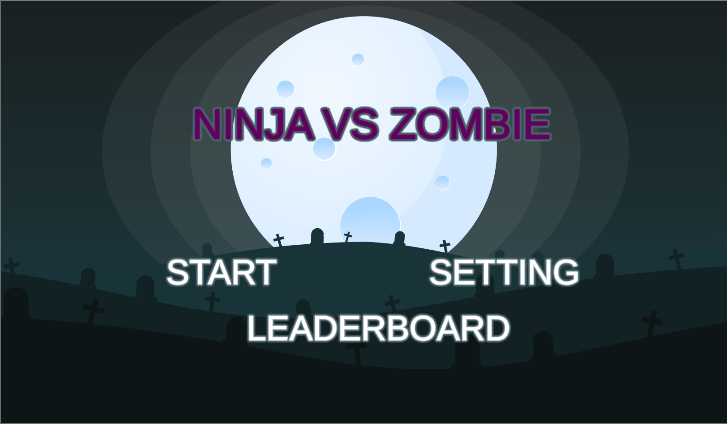
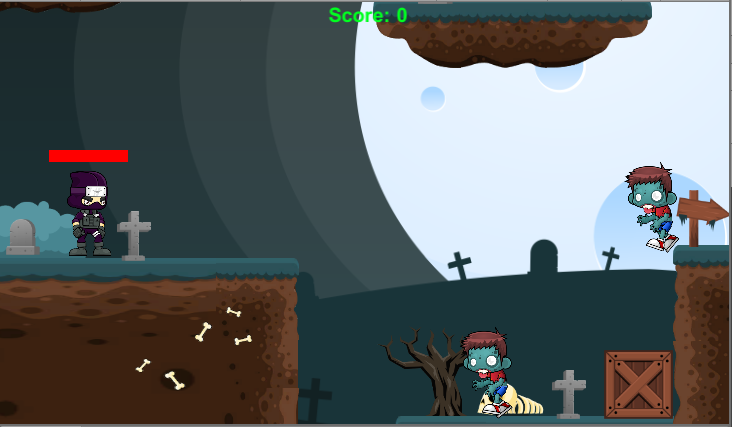
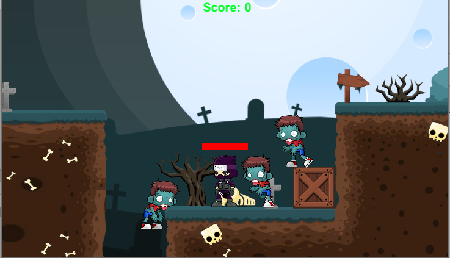
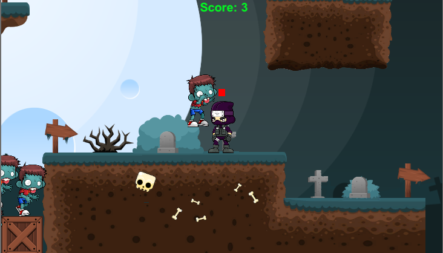
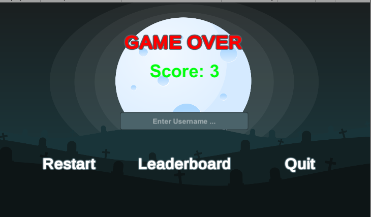

# Tugas Besar Unity IF3210 2019/2020

## Developer
- NIM   : 13517078
- Nama  : Irfan Sofyana Putra

## Deskripsi Aplikasi
Aplikasi ini adalah aplikasi yang dibuat dengan berbasiskan platform Unity. Oleh Developer, aplikasi 
ini diberi nama dengan "Ninja VS Zombie" karena terdapat pertarungan antara seorang ninja dengan 
zombie. 

### Kontrol Permainan
Right Arrow: Bergerak ke kanan
Left Arrow: Bergerak ke kiri
Spasi: Lompat
E: Menembak
Q: Menebaskan Pedang

## Cara Kerja Aplikasi
- Karakter pada game ini yaitu seorang ninja dibuat menjadi sebuah *game object*. Pada game object ini terdapat beberapa komponen yaitu RigidBody dan Collider yang akan mengatur aspek fisika pada permainan lalu *scripts* yang digunakan untuk mengatur *gameObject*
- Pergerakan dari ninja diatur pada keyboard seperti sudah dijelaskan pada sebelumnya. Hal ini dicapai dengan menggunakan 
`Input.GetKeyDown`
- Pergerakan camera mengikuti ninja dilakukan dengan cara mengubah posisi dari camera tersebut dengan mencari selisih posisi dari camera dan ninja tersebut
- Animasi pada permainan dilakukan dengan membuat Animation Controller.
- Zombie yang merupakan lawan akan digenerate secara acak dengan membuat sebuah script spawn random
- *Health* dari Ninja akan berkurang apabila mengenai zombie. Besarannya sesuai dari zombie tersebut. *Healt*  pada ninja diimplementasikan dengan membuat *bar* yang terletak di atas kepala ninja
- Untuk masalah score, setiap kali ninja mengalahkan musuh kecil akan mendapatkan score dan setiap mengalahkan musuh besar akan mendapatkan score 3.
- Setelah ninja mati, score yang dimiliki oleh pemain akan disimpan pada server dengan melakukan *POST Request* terlebih dahulu. *Post Request* dilakukan dengan cara menggunakan *library* Unity Web Request
- Saat pada main menu dan kasus *Game Over*, pemain dapat melihat scoreboard. Hal ini dilakukan dengan cara melakukan *GET Request* dengan menggunakan  *library* Unity Web Request dan SIMPLEJSON

## Penggunaan Library
Library yang digunakan dalam pembangunan aplikasi ini adalah

- SimpleJSON
  Digunakan dalam membuat HTTP Request
- TextMeshPro
  Digunakan untuk membuat tulisan pada *scene* "main menu" dan *scene* "gameover".

## Screenshot Aplikasi

